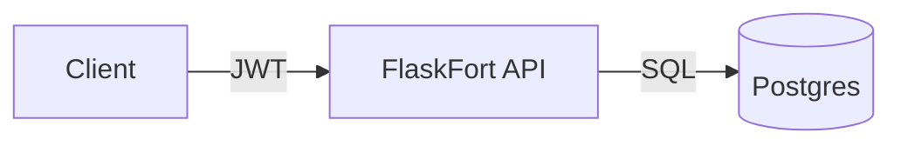

# FlaskFort

Secure Notes API shipped like a real product: JWT auth, Postgres, CI, Docker, and security
gates. Built as a portfolio‑ready backend service with professional DevSecOps workflows.


## Architecture



See `docs/architecture.md` for details.

## Features

- JWT auth (register/login)
- Notes CRUD with ownership enforcement
- Health check endpoint
- Tests + linting
- Dockerized API + Postgres
- CI pipeline with security gates

## Endpoints

- `POST /auth/register` {email, password}
- `POST /auth/login` {email, password} -> JWT
- `GET /notes`
- `POST /notes`
- `GET /notes/<id>`
- `PUT /notes/<id>`
- `DELETE /notes/<id>`
- `GET /healthz`

## Local run (SQLite)

```bash
cp .env.example .env
python -m pip install -r requirements.txt -r requirements-dev.txt
flask --app wsgi.py db upgrade
flask --app wsgi.py run
```

## Docker (Postgres)

```bash
docker compose up --build
```

## Quality gate

```bash
ruff check .
pytest
```

## Security gates (CI)

- gitleaks: blocks secret leaks
- pip-audit: blocks High/Critical dependency vulns
- trivy: blocks CRITICAL container vulns

Reports are uploaded as CI artifacts on each run.

## LLM (local Ollama)

Install Ollama and pull a model:
```bash
ollama pull llama3.1:8b
```

Set in `.env`:
```
OLLAMA_BASE_URL=http://host.docker.internal:11434
OLLAMA_MODEL=llama3.1:8b
```

This enables the local LLM endpoint at `POST /ai/assist` (no external billing).

## Release (SBOM)

Create a tag like `v1.0.0` and push it. The release workflow builds/pushes the image
to GHCR and attaches an `sbom.spdx.json` to the release.

## Deploy (optional CD)

This deploys the tagged image to a VM over SSH and rolls back if `/healthz` fails.

### Server setup (one time)

1. Install Docker + curl.
2. Create env file:
   - `/opt/flaskfort/.env`
   - include `DATABASE_URL`, `SECRET_KEY`, `JWT_SECRET_KEY`
3. Ensure port `8000` is reachable (or update `APP_PORT` in workflow).

### GitHub Actions secrets

- `SSH_HOST`
- `SSH_USER`
- `SSH_PORT`
- `SSH_KEY` (private key with access to server)

### Deploy

```bash
git tag v1.0.0
git push origin v1.0.0
```

## Docs

- `docs/architecture.md`
- `docs/threat-model.md`
