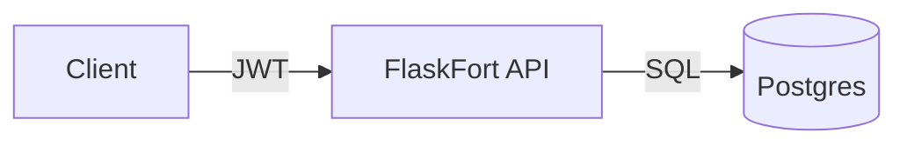

# Architecture

```mermaid
flowchart LR
    Client[Client] -->|JWT| API[FlaskFort API]
    API -->|SQL| DB[(Postgres)]
```

## Notes

- The API authenticates users with JWT and enforces per-user note ownership.
- The database stores users and notes; SQLite is used for local dev, Postgres for Docker.
